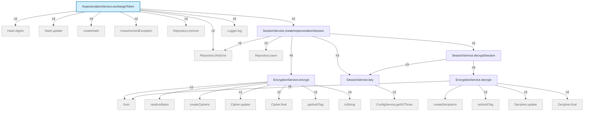

# Flow graph — `ImpersonationService.exchangeToken`

> Static outgoing-call graph via the `ts` provider (`trace graph`).
> **26** nodes · **28** edges · depth ≤ 4 · 20 external.
> Entry: `src/auth/impersonation/impersonation.service.ts:49:9` · root: `/Users/raunakburrows/hesta-dev/hesta-api`

## Call graph



_Rounded styling: blue = entry, grey = external dependency (`node_modules`), the rest is your code._

## Flow tree

```
graph — ImpersonationService.exchangeToken  (src/auth/impersonation/impersonation.service.ts:49)  via ts
  26 nodes · 28 edges · depth≤4 · 20 external

ImpersonationService.exchangeToken  src/auth/impersonation/impersonation.service.ts:49
├─ Hash.digest  ⊗ dep ×2
├─ Hash.update  ⊗ dep ×4
├─ createHash  ⊗ dep ×4
├─ Repository.findOne  ⊗ dep ×2
├─ UnauthorizedException  ⊗ dep ×2
├─ Repository.remove  ⊗ dep ×4
├─ SessionService.createImpersonationSession  src/auth/session/session.service.ts:85 ×2
│  ├─ Repository.save  ⊗ dep ×2
│  ├─ EncryptionService.encrypt  src/encryption/encryption.service.ts:10 ×6
│  │  ├─ from  ⊗ dep ×2
│  │  ├─ randomBytes  ⊗ dep
│  │  ├─ createCipheriv  ⊗ dep
│  │  ├─ Cipher.update  ⊗ dep ×2
│  │  ├─ Cipher.final  ⊗ dep ×2
│  │  ├─ getAuthTag  ⊗ dep ×2
│  │  └─ toString  ⊗ dep ×4
│  ├─ SessionService.key  src/auth/session/session.service.ts:22 ×3
│  │  └─ ConfigService.getOrThrow  ⊗ dep ×2
│  ├─ Repository.findOne  ⊗ dep ×2
│  └─ SessionService.decryptSession  src/auth/session/session.service.ts:104 ×2
│     ├─ EncryptionService.decrypt  src/encryption/encryption.service.ts:27 ×6
│     │  ├─ from  ⊗ dep ×6
│     │  ├─ createDecipheriv  ⊗ dep
│     │  ├─ setAuthTag  ⊗ dep ×2
│     │  ├─ Decipher.update  ⊗ dep ×2
│     │  └─ Decipher.final  ⊗ dep ×2
│     └─ SessionService.key  src/auth/session/session.service.ts:22 ×3  → shared
└─ Logger.log  ⊗ dep ×2
```

## Nodes

| Symbol | Kind | Location | Scope |
| --- | --- | --- | --- |
| `ImpersonationService.exchangeToken` | method | `src/auth/impersonation/impersonation.service.ts:49` | local |
| `Hash.digest` | method | _external_ | dep |
| `Hash.update` | method | _external_ | dep |
| `createHash` | function | _external_ | dep |
| `Repository.findOne` | method | _external_ | dep |
| `UnauthorizedException` | class | _external_ | dep |
| `Repository.remove` | method | _external_ | dep |
| `SessionService.createImpersonationSession` | method | `src/auth/session/session.service.ts:85` | local |
| `Logger.log` | method | _external_ | dep |
| `Repository.save` | method | _external_ | dep |
| `EncryptionService.encrypt` | method | `src/encryption/encryption.service.ts:10` | local |
| `SessionService.key` | getter | `src/auth/session/session.service.ts:22` | local |
| `SessionService.decryptSession` | method | `src/auth/session/session.service.ts:104` | local |
| `from` | method | _external_ | dep |
| `randomBytes` | function | _external_ | dep |
| `createCipheriv` | function | _external_ | dep |
| `Cipher.update` | method | _external_ | dep |
| `Cipher.final` | method | _external_ | dep |
| `getAuthTag` | method | _external_ | dep |
| `toString` | method | _external_ | dep |
| `ConfigService.getOrThrow` | method | _external_ | dep |
| `EncryptionService.decrypt` | method | `src/encryption/encryption.service.ts:27` | local |
| `createDecipheriv` | function | _external_ | dep |
| `setAuthTag` | method | _external_ | dep |
| `Decipher.update` | method | _external_ | dep |
| `Decipher.final` | method | _external_ | dep |
